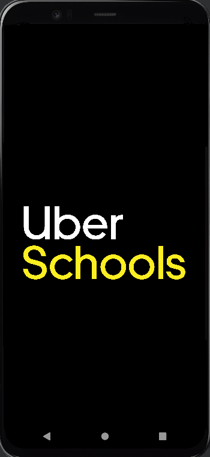
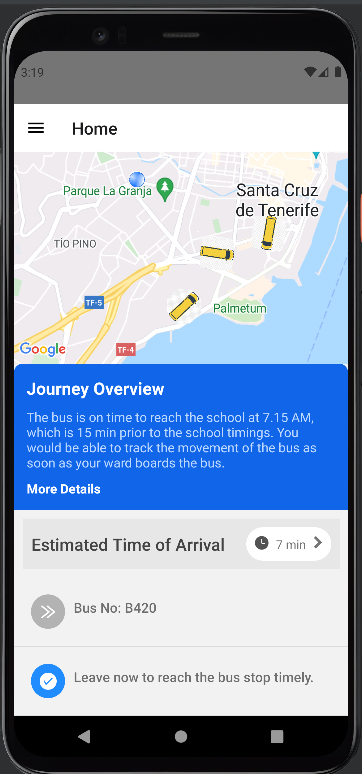
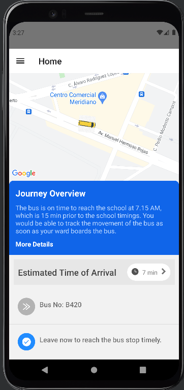
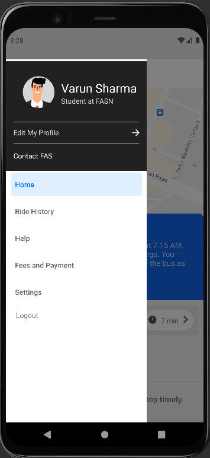
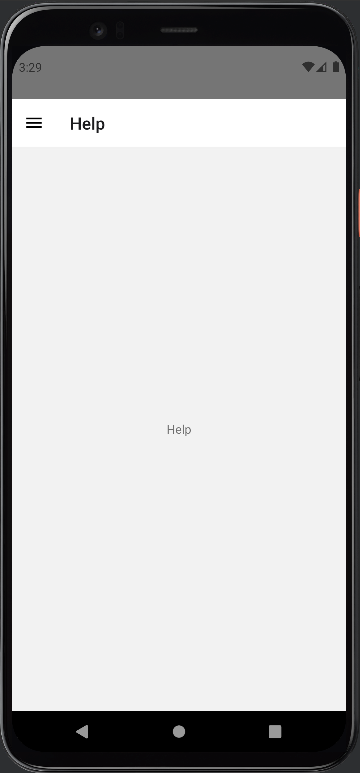

# React Native App : In Development

This is the code base that was used to make the UberSchools App for parents from scratch.

The app is developed in React Native and uses libraries such as:
- React Native Icons
- React Native Avatars
- React Native Navigation
- React Native Drawer Navigation
- React Native Maps

This app also uses Directions and Maps API from Google.
The API key used in the project has now been reset to avoid exceeding Google Quota's.
The app can be used after replacing the same in all the relevant directories.

## App Screenshots

 
 
 
 
 
